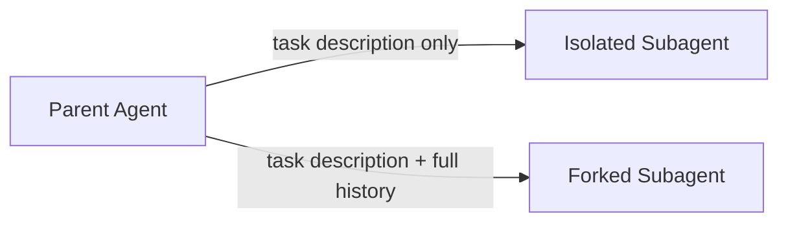

import ForkedSubagentsBasicPy from '/snippets/code-samples/forked-subagents-basic-py.mdx';
import ForkedSubagentsBasicJs from '/snippets/code-samples/forked-subagents-basic-js.mdx';
import ForkedSubagentsCompiledPy from '/snippets/code-samples/forked-subagents-compiled-py.mdx';
import ForkedSubagentsCompiledJs from '/snippets/code-samples/forked-subagents-compiled-js.mdx';

By default, a [subagent](/oss/deepagents/subagents) sees only the task description you give it—it starts with no memory of the conversation that led up to the delegation. A **forked subagent** is a separate spec type, @[`ForkedSubAgent`], that instead inherits the parent's full effective conversation history and exact system prompt.

Use forking when a subagent is delegated deep into an investigation and shouldn't have to re-derive context the parent already gathered—for example, handing an in-progress incident investigation off to a subagent that drafts the postmortem.

<Warning>
    Subagent forking is in [**beta**](/oss/versioning). APIs and behavior may change between releases.
</Warning>

## Configure a forked subagent

A forked subagent uses a separate spec, @[`ForkedSubAgent`], not `SubAgent`. It shares most `SubAgent` fields—`name`, `description`, `tools`, `model`, `middleware`, `interrupt_on`, `permissions`, `response_format`—but two are rejected outright rather than silently ignored:

- **`system_prompt`**—a forked subagent always uses the parent's inherited system prompt.
- **`skills`**—a fork's own skills injection would be immediately overwritten by the inherited system prompt, so it's rejected instead of quietly doing nothing.

:::python
<ForkedSubagentsBasicPy />
:::

:::js
<ForkedSubagentsBasicJs />
:::

## How it works

A forked subagent's system message isn't a static copy of the parent's prompt—it's captured dynamically from whatever the parent's own middleware actually produced on its last call (skills injection, memory, custom prompt mutation) and replayed into the fork verbatim. This is what lets the fork share the parent's prompt cache prefix instead of paying for a cold start; a fork's own tools still work normally, but expect cache misses where they diverge from the parent's.

The inherited history also gets a short preamble marking it as a continuation, not a fresh request.

## Forking a CompiledSubAgent

A [`CompiledSubAgent`](/oss/deepagents/subagents#compiledsubagent) can also set `mode: "fork"`. This inherits the parent's message history the same way, but keeps the compiled graph's own system prompt—a `CompiledSubAgent` is already fully built, so there's no system message for it to inherit into.

:::python
<ForkedSubagentsCompiledPy />
:::

:::js
<ForkedSubagentsCompiledJs />
:::

## When to use forking

| Dimension | Isolated (default) | Forked |
|-----------|---------------------|--------|
| **Context** | Only the task description | Full conversation history + exact system prompt |
| **Prompt cache** | Cold start every time | Shares the parent's cached prefix |
| **`system_prompt` / `skills`** | Own values | Not allowed—inherits the parent's |
| **Re-delegation** | Can call `task` normally | Refused—must complete the task itself |
| **Best for** | Focused, context-light work | Continuing an investigation the parent already has deep context on |

## See also

- [Subagents](/oss/deepagents/subagents): Configure subagent names, descriptions, and system prompts
- [Dynamic subagents](/oss/deepagents/dynamic-subagents): Dispatch subagents from interpreter code
- [Context engineering](/oss/deepagents/context-engineering): How conversation history is summarized as it grows
